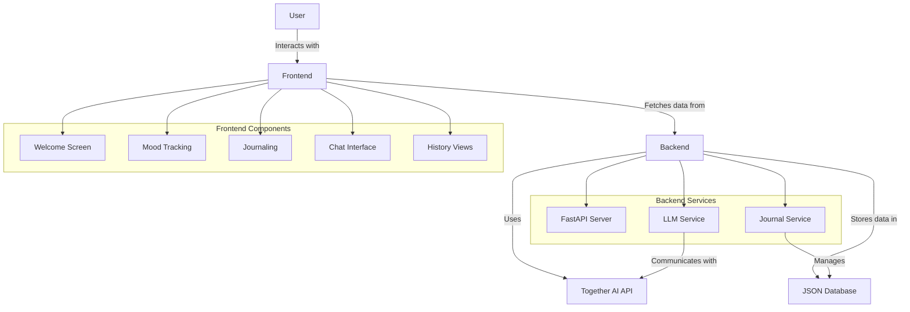

# MoodMate - Your Personal Emotional Companion

## 📱 Overview

MoodMate is a modern web application designed to help users track, understand, and improve their emotional well-being. Using advanced AI technology, MoodMate provides personalized insights and support based on your emotional state.

### Key Features

- **Mood Tracking**: Log and visualize your emotional states over time
- **AI-Powered Journaling**: Get personalized insights about your emotional patterns
- **Chat Support**: Engage in supportive conversations with an AI companion
- **Voice Journaling**: Record your thoughts and feelings through voice input
- **Progress History**: Review your emotional journey and track improvements

## 🚀 Tech Stack

### Frontend
- React 19 with Vite
- React Router for navigation
- Framer Motion for animations
- TailwindCSS for styling
- Vitest for testing

### Backend
- Python FastAPI framework
- Together AI for emotion analysis and natural language processing
- JSON file-based database

## 📊 System Architecture



## 🔧 Installation & Setup

### Prerequisites
- Node.js (v18+)
- Python (v3.10+)
- Together AI API key

### Getting Started

1. **Clone the repository**
   ```bash
   git clone https://github.com/yourusername/moodmate-app.git
   cd moodmate-app
   ```

2. **Set up the backend**
   ```bash
   cd backend
   python -m venv venv
   source venv/bin/activate  # On Windows: venv\Scripts\activate
   pip install -r requirements.txt
   ```

3. **Configure environment variables**
   Create a `.env` file in the backend directory:
   ```
   TOGETHER_API_KEY=your_together_api_key
   TOGETHER_MODEL=meta-llama/Meta-Llama-3.1-8B-Instruct-Turbo
   ```

4. **Set up the frontend**
   ```bash
   cd ../frontend
   npm install
   ```

5. **Start the application**
   
   Backend:
   ```bash
   cd backend
   # On Windows:
   start.bat
   # On Linux/Mac:
   ./start.sh
   ```
   
   Frontend:
   ```bash
   cd frontend
   npm run dev
   ```

6. **Open the application**
   Navigate to `http://localhost:5173` in your web browser

## 📊 Application Structure

```
moodmate-app/
├── backend/               # Python FastAPI backend
│   ├── app/               # Main application package
│   │   ├── api/           # API endpoints
│   │   ├── config/        # Configuration settings
│   │   ├── models/        # Data models
│   │   ├── services/      # Business logic services
│   │   └── utils/         # Utility functions
│   ├── db.json            # JSON database
│   └── main.py            # Application entry point
│
├── frontend/              # React frontend
│   ├── public/            # Static assets
│   └── src/               # Source code
│       ├── assets/        # Images, icons, animations
│       ├── components/    # Reusable UI components
│       ├── pages/         # Page components
│       └── services/      # API service clients
│
└── public/                # Shared public assets
    └── animations/        # Animation files
```

## 💡 Usage

1. **Create an account or sign in**
   - Enter your name on the welcome screen

2. **Track your mood**
   - Record your current emotional state
   - Add context or journal entries

3. **Review your history**
   - See patterns in your emotional states
   - Review past journal entries

4. **Chat with your AI companion**
   - Get personalized support and guidance
   - Explore strategies for emotional well-being

## 🧠 How It Works

MoodMate uses advanced AI models from Together AI to:
1. Analyze emotional content in journal entries
2. Generate personalized insights and recommendations
3. Provide supportive conversation through the chat interface

## Future Plans
1. Add User Authentication
2. Customize Home Screen with insights and Trends

## 📜 License

This project is licensed under the MIT License - see the LICENSE file for details.

## 🙏 Acknowledgements

- Together AI for their powerful language models
- The React and FastAPI communities for their excellent documentation
- All contributors who have helped shape this project 
